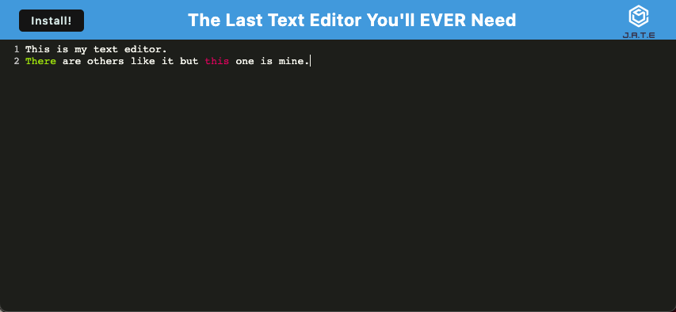
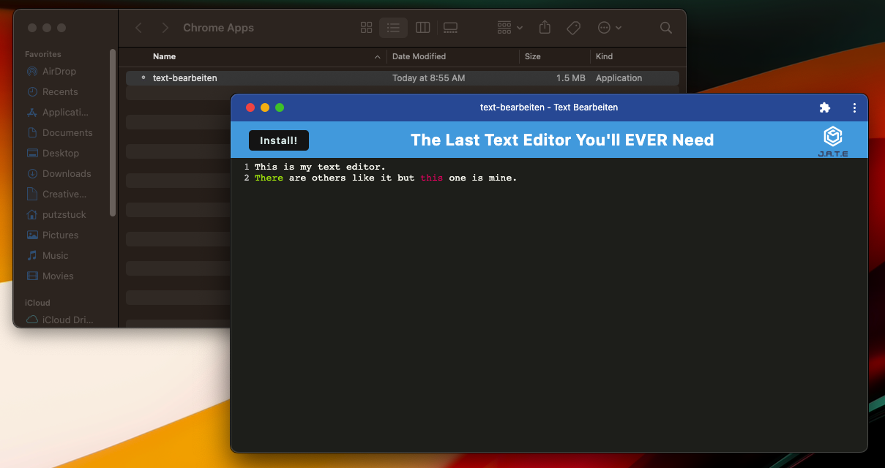

# TEXT BEARBEITEN

## Description

Installable application to edit and compile text.

- Tackle the challenge of creating a PWA for the first time!
- It allows the application to be installed locally and function offline in the web browser.
- Learned how to handle service workers and formatting for the webpack.config file.

## Table of Contents

- [Installation](#installation)
- [Usage](#usage)
- [Credits](#credits)
- [License](#license)

## Installation

Navigate to the URL in your favorite browser.  Click 'Install' and then 'Ok' on the following prompt.

## Usage

Simply type text into the application.  To move to a new line, hit the Enter key on your keyboard.

## Credits

N/A

## License

MIT License

## Questions

- Email: putzstuck@gmail.com
- GitHub Profile: https://github.com/argounova
